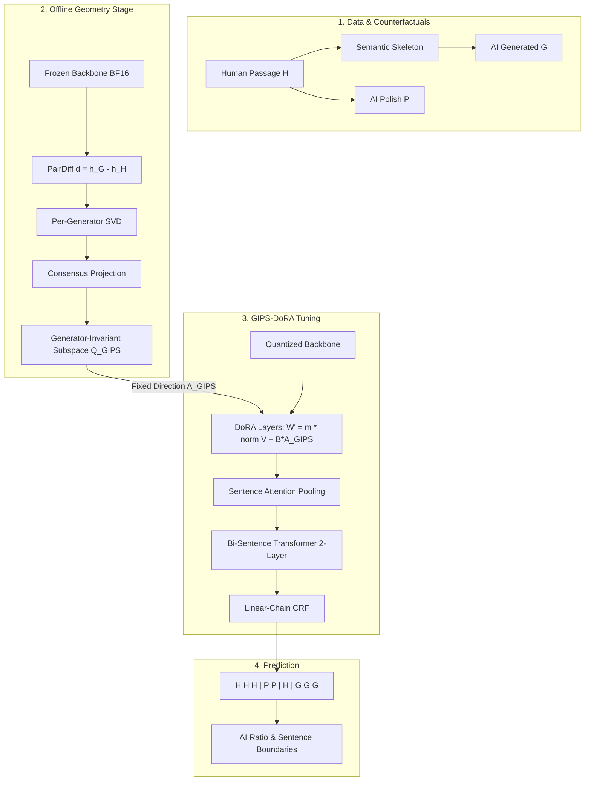

# 🎓 GIPS-DoRA: Vietnamese AI-Generated Text Detection & Sentence-Level Segmentation

> **Current Human v3.2 owner-approved ready release (2026-10-07):** [22,295 chunks from 830 documents](human_v3_2_ready_v73_20261007/), with train/dev/test JSONL and 263 known rejects kept in quarantine. Read its [dataset card](human_v3_2_ready_v73_20261007/DATASET_CARD.md) for the unverified visual-review and rights-metadata limits.

> **Quality estimate for v73:** a new 120-chunk random text-screen sample found 87 provisional passes, 3 uncertain, and 30 rejects. The exploratory pass estimate is **72.5-75.0%**, not a full PDF-verified ready rate. See the [audit and remediation plan](human_v3_2_quality_estimate_v74_20261007/REPORT.md).

> **Historical Human v3.1 candidate:** the earlier PDF-based pipeline rebuilt 432 source documents into hierarchical passages and t128/t192/t256 chunk streams. Full structural and PDF-replay validation passed with 0 errors, but that v3.1 corpus was **not ready for training**: an independent [publication-readiness audit](human_v3_publication_audit/REPORT.md) found unresolved domain, short-window, bullet, encoding and heading-quality issues; its ready exports are empty. Its output is `human_written_dataset_v3_1_hierarchical/`. See [Human v3.1 instructions](human_dataset_pipeline/HUMAN_V3.md) and the [implementation report](docs/human_v3_implementation_report.md).

[](https://www.python.org/)
[](human_written_dataset_v2_16_paper/)
[](ai_counterfactual_dataset_v1/)
[](human_written_dataset_v2_16_paper/gips_curated/splits/)
[](LICENSE)

---

### 🇻🇳 Tóm Lược Dự Án (Executive Summary in Vietnamese)
> **Mục tiêu nghiên cứu**: Phát hiện và phân đoạn văn bản do AI tạo ra (AI-Generated Text Detection & Segmentation) trong các luận văn, đồ án tốt nghiệp ngành Công nghệ Thông tin (CNTT) tiếng Việt.  
> **Nhiệm vụ cốt lõi**: Phân loại nhãn đa cấp độ mức câu và xác định ranh giới hỗn hợp:
> - **`H` (Human-written)**: Câu do người viết nguyên bản trong luận văn.
> - **`P` (AI-Polished)**: Câu do người viết được AI trau chuốt, tinh chỉnh (3 mức: Light, Medium, Heavy).
> - **`G` (AI-Generated)**: Đoạn văn do mô hình ngôn ngữ lớn (LLM) sinh độc lập dựa trên khung xương ngữ nghĩa (*Semantic Skeleton*).  
> **Phương pháp đề xuất**: **`GIPS-DoRA`** (*Generator-Invariant Provenance Subspace Guided Weight-Decomposed Low-Rank Adaptation*).  
> **Trạng thái hiện tại**: Đã hoàn thiện toàn bộ tầng dữ liệu chuẩn hóa gồm **Release v2.16 (21,024 passages / 162,555 câu curated)**, **pipeline sinh dữ liệu đối ứng AI Counterfactuals**, và tài liệu đặc tả kiến trúc toán học tại [`docs/overall_architect.md`](docs/overall_architect.md).  
> *(Lưu ý: 427 file PDF luận văn gốc được lưu trữ offline tại máy trạm nghiên cứu, không upload lên GitHub nhằm đảm bảo bản quyền học thuật và tối ưu kích thước repository).*

---

## 📑 Table of Contents
1. [Research Motivation & Problem Formulation](#-1-research-motivation--problem-formulation)
2. [Dataset Architecture & Deep Dive](#-2-dataset-architecture--deep-dive)
   - [2.1 Data Layer Hierarchy](#21-data-layer-hierarchy)
   - [2.2 Curation Statistics & Sub-Discipline Distribution](#22-curation-statistics--sub-discipline-distribution)
   - [2.3 Preprocessing & Quality Engineering](#23-preprocessing--quality-engineering)
   - [2.4 AI Counterfactual Construction (P & G)](#24-ai-counterfactual-construction-p--g)
   - [2.5 Zero-Leakage Split Strategy](#25-zero-leakage-split-strategy)
3. [Methodological Overview: GIPS-DoRA](#-3-methodological-overview-gips-dora)
   - [3.1 High-Level Architecture](#31-high-level-architecture)
   - [3.2 Mathematical Formulation](#32-mathematical-formulation)
   - [3.3 Comprehensive Architecture Specification](#33-comprehensive-architecture-specification)
4. [Repository Directory Structure](#-4-repository-directory-structure)
5. [Quickstart & Reproduction Guide](#-5-quickstart--reproduction-guide)
6. [Data Safety & Git Best Practices](#-6-data-safety--git-best-practices)
7. [Citation](#-7-citation)

---

## 🔬 1. Research Motivation & Problem Formulation

Large Language Models (LLMs) have demonstrated human-level capability in academic writing, introducing substantial challenges in academic integrity. While existing AI-text detectors predominantly focus on English document-level binary classification (AI vs. Human), real-world academic plagiarism exhibits two critical nuances:

1. **Hybrid Compositionality**: Authors rarely submit purely AI-generated documents. Instead, real submissions interweave human paragraphs with AI-polished sentences and AI-synthesized sections.
2. **Linguistic & Morphological Specifics of Vietnamese**: Academic Vietnamese exhibits tone marks, diacritics, and monosyllabic tokens. OCR or poorly parsed PDFs often suffer from corrupted Unicode CMap tables, merged syllables ("dính chữ"), and non-standard typography.

### Problem Formulation

Given an academic document decomposed into an ordered sequence of sentences $S = (s_1, s_2, \dots, s_N)$, our objective is threefold:

- **Sentence-Level Provenance Labeling**: Predict the provenance label $y_i \in \{H, P, G\}$ for each sentence $s_i$.
- **Boundary Segmentation**: Determine the transition points $i$ where $y_i \neq y_{i+1}$ directly from label state transitions without requiring an ad-hoc boundary detection module.
- **Composition Metrics**: Compute length-weighted AI contribution ratios across the document:

```math
\mathcal{R}_G = \frac{\sum_{i: y_i = G} \text{len}(s_i)}{\sum_{i=1}^N \text{len}(s_i)}
```

```math
\mathcal{R}_{\text{AI-assisted}} = \frac{\sum_{i: y_i \in \{P, G\}} \text{len}(s_i)}{\sum_{i=1}^N \text{len}(s_i)}
```

---

## 📊 2. Dataset Architecture & Deep Dive

The repository provides an end-to-end data pipeline ranging from metadata acquisition to ready-to-train curated splits.

### 2.1 Data Layer Hierarchy

```text
DATASET_CNTT_SAU_PREPROCESS/ (Crawled Library Metadata & Source Catalogs)
       │
       ▼ [Standardization & Paragraph Consolidation]
human_written_dataset_v2_16_paper/ (387 Accepted Documents, 34,158 Passages)
       │
       ├────────────────────────────────────────┬────────────────────────────────────────┐
       ▼                                        ▼                                        ▼
gips_curated/ (Official Training View)   manifest/ (SHA256 Lineage)               reports/ (Audit Logs)
├── passages_gips_ready.jsonl (43.6 MB)
├── sentences_gips_ready.jsonl (79.9 MB)
└── splits/ (Zero-leakage train/dev/test)
       │
       ▼ [Semantic Skeleton Extraction + Multi-LLM Parallel Realization]
ai_counterfactual_dataset_v1/
├── counterfactual_records.jsonl (H ↔ P, H ↔ G Paired Records, 3.97 MB)
└── hybrid_sequences.jsonl (Mixed Sentence Sequences for CRF Modeling)
```

> **Note on Raw Thesis Acquisition**: The raw 427 graduation thesis PDFs (~1.69 GB) were extracted and normalized in the offline development environment (`Dataset_khoaluan/`). Due to institutional intellectual property and GitHub storage boundaries, the raw PDFs are retained on the research workstation, while all processed, normalized, and curated datasets are hosted directly in this repository.

| Layer | Directory / File | Scale & Format | Description |
| :--- | :--- | :--- | :--- |
| **Tier 1: Library Metadata** | `DATASET_CNTT_SAU_PREPROCESS/` | JSONL + Python Crawlers | Digital library metadata, anti-ban crawler scripts, and institutional records (VNU, OU, etc.). |
| **Tier 2: Reference Human Corpus** | `human_written_dataset_v2_16_paper/` | Release v2.16 (JSONL) | 387 verified documents, 34,158 standardized passages, full page-level lineage and checksums. |
| **Tier 3: Curated Training View** | `human_written_dataset_v2_16_paper/gips_curated/` | 21,024 passages / 162,555 sentences | Filtered, length-bounded (64–512 tokens), zero-leakage partitioned for model training. |
| **Tier 4: AI Counterfactuals** | `ai_counterfactual_dataset_v1/` | JSONL (H/P/G records) | High-fidelity paired counterfactuals generated via semantic skeletons and multiple LLM families. |

---

### 2.2 Curation Statistics & Sub-Discipline Distribution

From the initial 34,158 candidate passages in Release v2.16, exact filtering yielded **21,024 high-integrity body passages** containing **162,555 validated sentences**.

#### Topic Distribution
The dataset is stratified across five core Computer Science sub-disciplines:

| Sub-Discipline (Chuyên Ngành) | Passages | Percentage | Typical Topics |
| :--- | :---: | :---: | :--- |
| **Software Engineering** | 9,007 | 42.84% | Microservices, DevOps, Web/Mobile architectures, CI/CD |
| **Networking & Communications** | 4,018 | 19.11% | SDN, IoT protocols, Cloud routing, Network security |
| **Artificial Intelligence & Data Science** | 3,675 | 17.48% | Deep Learning, NLP, Computer Vision, Recommenders |
| **Information Systems** | 3,343 | 15.90% | ERP, Database optimization, E-commerce, BI |
| **Cybersecurity & Cryptography** | 981 | 4.67% | Intrusion detection, Cryptographic protocols, Pen-testing |
| **Total** | **21,024** | **100.0%** | Comprehensive coverage of undergraduate & graduate CS |

#### Token Length Distribution (Passage Level)

| Token Range (Tokens / Passage) | Passage Count | Share | Status |
| :---: | :---: | :---: | :--- |
| `< 64` | 11,941 | - | Filtered / Short tails |
| `64 – 127` | 6,068 | 28.86% | Retained in Curated |
| `128 – 255` | 6,584 | 31.32% | Retained in Curated |
| `256 – 512` | 9,565 | 45.49% | Retained in Curated |
| `> 512` | 0 | 0.00% | Length-guarded |

---

### 2.3 Preprocessing & Quality Engineering

The pipeline in `human_dataset_pipeline/` handles real-world academic text degradation:
1. **CMap Glyphs & Unicode Normalization** (`unicode_normalization.py`):
   - Restores corrupted tone marks (NFC composition).
   - Reconstructs missing whitespace caused by broken PDF kerning tables.
2. **Viterbi Dynamic De-gluing** (`text_healing.py`):
   - Detects and separates fused words (e.g., `hethongthongtin` $\to$ `he thong thong tin`) using an n-gram syllable vocabulary and dynamic programming scoring.
3. **Layout Reconstruction** (`layout_reconstruction.py`):
   - Strips headers, footers, page numbering, table of contents, and bibliography sections, preserving exclusively the body prose.

---

### 2.4 AI Counterfactual Construction (P & G)

To avoid topic confounding (where the model classifies *what* is discussed rather than *who* wrote it), we enforce **controlled counterfactual transformation**:

```text
                    [ Human Passage H ]
                             │
            ┌────────────────┴────────────────┐
            ▼                                 ▼
   [ AI Polish (P) ]               [ Semantic Skeleton Extraction ]
   - Light: grammar, spelling      - Key technical entities
   - Medium: sentence rewrites     - Quantitative figures & formulas
   - Heavy: passage restructuring  - Arguments & causal links
            │                                 │
            ▼                                 ▼
   Output P (Sentence-level)        [ Generator Realization (G) ]
                                    (Qwen, Llama, DeepSeek, GPT-family)
                                              │
                                              ▼
                                    Output G (Sentence-level)
```

1. **AI-Polished ($P$)**: Retains the human passage as input and systematically transforms it across three intensity tiers (`P-light`, `P-medium`, `P-heavy`).
2. **AI-Generated ($G$)**: The human passage is abstracted into an invariant **Semantic Skeleton** (entities, claims, constraints). The skeleton is then independently expanded by diverse LLM families into authentic Vietnamese prose.
3. **Hybrid Sequences**: Assembled via `hybrid_synthesizer.py` to create stochastic sentence transitions ($H \to P \to H \to G$) mirroring real-world student editing patterns.

---

### 2.5 Zero-Leakage Split Strategy

Data is partitioned strictly at the **Source Document Level**. Sentences or passages originating from the same thesis are guaranteed to reside in the same split:

| Split | Passages | Passages Ratio | Zero-Leakage Guarantee |
| :--- | :---: | :---: | :--- |
| **`train.jsonl`** | 15,545 | ~73.9% | Document ID Hash disjoint |
| **`dev.jsonl`** | 2,951 | ~14.0% | Document ID Hash disjoint |
| **`test.jsonl`** | 2,528 | ~12.1% | Document ID Hash disjoint |
| **Total** | **21,024** | **100.0%** | Full traceability in `manifest/` |

---

## 🧠 3. Methodological Overview: GIPS-DoRA

### 3.1 High-Level Architecture

The target detection framework couples representation geometry with parameter-efficient fine-tuning:



### 3.2 Mathematical Formulation

- **PairDiff Geometry**: For a paired source passage $s$ and generator family $g$, we measure the transformation vector:

```math
d_{(s, g)} = h(G_{(s,g)}) - h(H_s)
```

- **Consensus Subspace ($Q_{\text{GIPS}}$)**: By computing the SVD of transformations across disparate generator families (Qwen, Llama, DeepSeek, GPT) and taking the principal eigenspace of their projection consensus, we isolate the invariant *essence of AI generation* while discarding generator-specific fingerprints:

```math
P_g = Q_g Q_g^T, \quad M = \frac{1}{|G|} \sum_{g \in G} P_g, \quad Q_{\text{GIPS}} = \text{TopEig}(M, r)
```

- **Directional Constraint (GIPS-DoRA)**:

```math
W' = m \odot \frac{V + B \cdot A_{\text{GIPS}}}{\|V + B \cdot A_{\text{GIPS}}\|_c}
```

where $A_{\text{GIPS}}$ is mathematically fixed to the provenance subspace, forcing parameter adaptation to occur exclusively along directions indicative of machine generation.

### 3.3 Comprehensive Architecture Specification

For detailed mathematical proofs, low-rank hypotheses, layer-wise mapping protocols, quantization benchmarks, and ablation specifications, refer to:
👉 [**`docs/overall_architect.md`**](docs/overall_architect.md)

---

## 📁 4. Repository Directory Structure

```text
NCKH-Classify_Segmentation_AI_Generated_Text/
├── DATASET_CNTT_SAU_PREPROCESS/       # Scraped digital library metadata (VNU, OU)
│   ├── crawlers/                     # Anti-ban crawlers with jitter delay & checkpoints
│   └── json/                         # Raw catalog records (dataset_cntt_all.jsonl)
│
├── human_written_dataset_v2_16_paper/ # Official Human Dataset Release (v2.16)
│   ├── documents.jsonl               # Document-level texts and metadata (29.3 MB)
│   ├── gips_curated/                 # ⭐ CURATED TRAINING DATASET READY FOR EXPERIMENTS
│   │   ├── curation_summary.json     # Quantitative metrics across topics & lengths
│   │   ├── passages_gips_ready.jsonl # 21,024 standardized passages (43.6 MB)
│   │   ├── sentences_gips_ready.jsonl# 162,555 healed sentences (79.9 MB)
│   │   ├── sentences_by_split/       # Sentences partitioned by train/dev/test
│   │   └── splits/                   # Zero-leakage partitions: train, dev, test
│   ├── manifest/                     # SHA256 hashes, source file traceability
│   ├── reports/                      # Automated data audit & quality reports
│   └── DATASET_CARD.md               # Formal dataset documentation card
│
├── ai_counterfactual_dataset_v1/     # Generated AI Counterfactual Dataset
│   ├── counterfactual_records.jsonl  # 1,056 H->P (Light/Med/Heavy) & H->G pairs (3.97 MB)
│   └── hybrid_sequences.jsonl        # Multi-label sentence sequences for CRF evaluation
│
├── human_dataset_pipeline/           # PDF extraction, CMap restoration & healing engine
│   ├── layout_reconstruction.py      # Boundary detection, column & span reconstruction
│   ├── unicode_normalization.py      # Tone restoration & Unicode NFC canonicalization
│   ├── text_healing.py               # Viterbi syllable de-gluing algorithm
│   ├── prepare_gips_training_data.py # Curated dataset filtering & split synthesis
│   └── test_release_validation.py    # Automated test suite for data validation
│
├── counterfactual_pipeline/          # Counterfactual generation & synthesis engine
│   ├── providers/                    # Model wrappers (Gemini, OpenAI, OpenRouter, Mock)
│   ├── skeleton_extractor.py         # Semantic skeleton extractor (entities, facts, claims)
│   ├── prompt_templates.py           # Standardized prompts with cryptographic integrity hashes
│   ├── generator.py                  # Batch orchestration with resumption checkpoints
│   └── hybrid_synthesizer.py         # Mixed-sequence builder for sequence labelers
│
├── docs/                             # Academic & Architectural Documentation
│   ├── overall_architect.md          # Complete mathematical specification of GIPS-DoRA
│   ├── dataset_human_written_plan.md # Human corpus design and curation protocols
│   └── pp_tien_xu_ly.md              # Detailed preprocessing methodology & benchmarks
│
├── .env.example                      # Environment variables template (API keys)
└── .gitignore                        # Security & Git file size policy configuration
```

---

## 🚀 5. Quickstart & Reproduction Guide

### Step 1: Environment Setup
Ensure Python 3.10+ is installed:
```bash
# Clone the repository
git clone https://github.com/XLaiHuy/-GIPS-DoRA.git
cd -GIPS-DoRA

# Configure API credentials
cp .env.example .env
# Edit .env with your LLM API keys (GEMINI_API_KEY, OPENAI_API_KEY)
```

### Step 2: Validate Human Dataset Release v2.16
Run the automated validation suite to assert schema integrity and split disjointness:
```bash
python human_dataset_pipeline/test_release_validation.py
```

### Step 3: Run Pilot Counterfactual Generation (Mock Test)
Validate the counterfactual generator pipeline without consuming API credits:
```bash
python counterfactual_pipeline/run_counterfactual_pilot.py \
    --provider mock \
    --n_train 10 \
    --n_dev 5 \
    --n_test 5 \
    --synthesize_hybrids
```

### Step 4: Verify Zero-Leakage Split Integrity
Assert that no passage, sentence, or document overlaps across splits:
```bash
python counterfactual_pipeline/validate_counterfactuals.py \
    --dataset ai_counterfactual_dataset_v1/counterfactual_records.jsonl \
    --human_splits human_written_dataset_v2_16_paper/gips_curated/splits
```

---

## 🔒 6. Data Safety & Git Best Practices

- **GitHub 100MB File Limit**: All primary training files located in `human_written_dataset_v2_16_paper/gips_curated/` and `ai_counterfactual_dataset_v1/` are strictly **under 80 MB**, allowing seamless git commits without mandatory Git LFS subscriptions.
- **Gitignore Protection**: Raw PDF files, sensitive credentials (`.env`, `ou_auth.json`), and multi-gigabyte page lineage logs are protected by `.gitignore`.
- **Reproducibility Guarantee**: Every curated record in `gips_curated` can be traced back to its raw PDF byte offset and SHA256 checksum through `manifest/source_files.jsonl`.

---

## 📖 7. Citation

If you utilize the GIPS-DoRA dataset or methodological specifications in your research, please cite:

```bibtex
@misc{gips_dora_vietnamese_2026,
  author    = {Research Team on AI-Generated Text Detection},
  title     = {GIPS-DoRA: Generator-Invariant Provenance Subspace Guided Weight-Decomposed Low-Rank Adaptation for Vietnamese Academic Text Detection and Segmentation},
  year      = {2026},
  publisher = {GitHub},
  howpublished = {\url{https://github.com/XLaiHuy/-GIPS-DoRA}}
}
```
